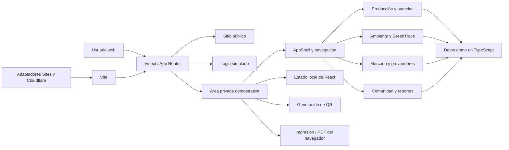
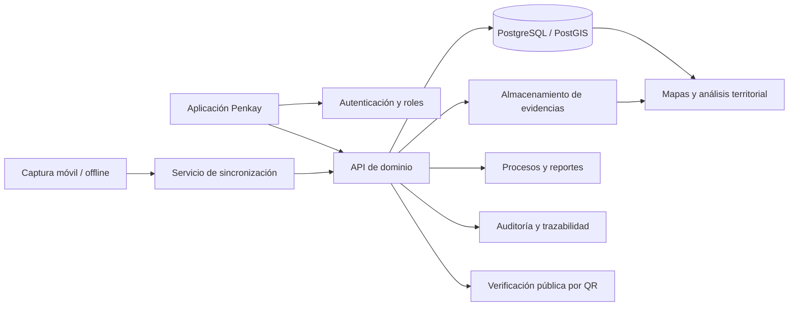

# Arquitectura y funcionalidad del MVP de Penkay

## 1. Resumen

Penkay es un MVP web responsive para demostrar cómo una red de productores de penco puede consultar y registrar información productiva, territorial, ambiental y comercial desde una sola interfaz.

La versión actual es un **prototipo funcional de frontend**: permite navegar, filtrar información, abrir formularios, modificar datos durante la sesión, generar códigos QR y preparar reportes imprimibles. No incorpora todavía autenticación real, API, base de datos ni almacenamiento permanente.

## 2. Objetivo del MVP

El MVP valida cinco ideas principales:

1. Un productor puede entender rápidamente el estado de sus parcelas y cultivos.
2. La información productiva y ambiental puede presentarse con su fuente o nivel de evidencia.
3. Los productos derivados del penco pueden mostrar origen y trazabilidad mediante QR.
4. Productores, proveedores, academia y jóvenes PencoTech pueden convivir en un mismo ecosistema digital.
5. La información de una parcela puede convertirse en reportes y pasaportes ambientales comprensibles.

## 3. Arquitectura general



### Flujo técnico

1. El navegador solicita una ruta de la aplicación.
2. Vinext interpreta la estructura compatible con Next.js ubicada en `app/`.
3. Cada página compone componentes reutilizables de `components/ui/` y el contenedor `AppShell`.
4. Los datos demostrativos se leen desde constantes TypeScript o desde el propio módulo de la página.
5. Las interacciones se ejecutan en el cliente con estado de React.
6. Vite realiza el desarrollo y la compilación; los complementos de Sites y Cloudflare preparan el proyecto para un runtime compatible con Workers.

## 4. Stack tecnológico

| Capa | Tecnología | Responsabilidad |
| --- | --- | --- |
| Lenguaje | TypeScript | Tipado y lógica de la aplicación |
| Interfaz | React 19 | Componentes y estado interactivo |
| Framework | Vinext | Enrutamiento y modelo compatible con Next.js |
| Construcción | Vite 8 | Servidor de desarrollo y build |
| Estilos | Tailwind CSS 4 y CSS global | Diseño responsive, tokens y presentación |
| Componentes | Shadcn / Base UI | Botones, diálogos, tarjetas, pestañas y formularios accesibles |
| Iconos | Lucide React | Iconografía consistente |
| Trazabilidad | `qrcode.react` | QR de productos y pasaporte ambiental |
| Runtime objetivo | Cloudflare Workers | Ejecución compatible para una futura publicación |
| Integración de sitio | OpenAI Sites | Preparación del proyecto y vista local |

El proyecto requiere Node.js 22.13 o superior. El archivo `iniciar.ps1` permite usar el runtime local disponible aunque `pnpm` no esté registrado en el `PATH` de Windows.

## 5. Organización del código

```text
penkay/
├── app/
│   ├── page.tsx                 # Sitio público
│   ├── login/page.tsx           # Acceso demostrativo
│   ├── perfil/page.tsx          # Dashboard del productor
│   ├── parcelas/page.tsx        # Gestión territorial
│   ├── plantas/page.tsx         # Plantas y muestras
│   ├── productos/page.tsx       # Catálogo y trazabilidad
│   ├── proveedores/page.tsx     # Proveedores y distribución
│   ├── comunidad/page.tsx       # Academia y PencoTech
│   ├── greentrace/page.tsx      # Indicadores ambientales
│   ├── reportes/page.tsx        # Centro de reportes
│   ├── layout.tsx               # Metadatos, idioma y fuentes
│   └── globals.css              # Tema y estilos compartidos
├── components/
│   ├── penkay/app-shell.tsx     # Navegación y estructura privada
│   └── ui/                      # Primitivas reutilizables
├── lib/
│   ├── demo-data.ts             # Métricas, eventos y productos demo
│   └── utils.ts                 # Utilidades de composición CSS
├── public/                      # Imagen principal y favicon
├── .openai/hosting.json         # Capacidades de hosting; D1 y R2 desactivados
├── iniciar.ps1                  # Inicio y compilación en Windows
├── vite.config.ts               # Vinext, Sites y Cloudflare
└── package.json                 # Dependencias y scripts
```

## 6. Funcionalidad por ruta

| Ruta | Funcionalidad actual |
| --- | --- |
| `/` | Presenta la propuesta de valor, métricas, módulos del ecosistema y recursos informativos. |
| `/login` | Formulario de acceso con rol, validación de campos, mostrar/ocultar contraseña y redirección simulada. |
| `/perfil` | Resumen productivo, mapa esquemático, actividad reciente, estado del suelo, calendario y generación de reportes. |
| `/parcelas` | Lista y mapa de parcelas; permite agregar una parcela durante la sesión. |
| `/plantas` | Métricas y muestras; permite incrementar el registro de plantas durante la sesión. |
| `/productos` | Búsqueda por texto, filtro por categoría y modal con QR de trazabilidad. |
| `/proveedores` | Directorio en pestañas para insumos, servicios y distribuidores. |
| `/comunidad` | Ruta de formación PencoTech, progreso, oportunidades y alianzas. |
| `/greentrace` | Indicadores ambientales, clasificación de evidencia y pasaporte ambiental con QR. |
| `/reportes` | Catálogo de reportes y apertura del diálogo de impresión para guardar como PDF. |

## 7. Flujos principales

### 7.1 Acceso demostrativo

- La pantalla incluye datos genéricos precargados.
- Valida que correo y contraseña no estén vacíos.
- El rol `productor` redirige a `/perfil`.
- Los demás roles redirigen a `/comunidad`.
- No se valida la contraseña contra un servidor y no se crea una sesión real.

Credenciales de demostración:

- Usuario: `productor@penkay.ec`
- Contraseña: `Penkay2026`

### 7.2 Registro de parcelas y plantas

- Los formularios usan diálogos accesibles.
- Una parcela nueva se agrega a la lista visible.
- Un registro de plantas actualiza el contador de plantas activas.
- Los cambios viven únicamente en memoria y se pierden al recargar la página.

### 7.3 Catálogo y trazabilidad

- La búsqueda compara nombre del producto, productor y comunidad.
- El filtro limita los resultados por categoría.
- Cada producto puede abrir una ficha con código, origen y QR.
- Las URL `penkay.ec` de los QR son demostrativas y no representan todavía endpoints publicados.

### 7.4 Evidencia ambiental

- Los indicadores distinguen valores **medidos**, **observados** y **estimados**.
- El pasaporte ambiental resume parcela, superficie, plantas, conservación y carbono potencial.
- El MVP aclara que la estimación de carbono no equivale a un crédito certificado.

### 7.5 Reportes

- El usuario selecciona un tipo de reporte.
- La aplicación prepara la vista y ejecuta `window.print()`.
- El navegador permite imprimir o guardar el resultado como PDF.
- En `/perfil` se expone además una herramienta WebMCP llamada `generate_penco_report` cuando el navegador anfitrión admite esa interfaz.

## 8. Estado y datos

### Estado actual

El estado interactivo se administra con `useState` y `useEffect` dentro de las páginas cliente. No se usa un store global porque los flujos del prototipo son pequeños e independientes.

### Datos actuales

Los datos se encuentran en:

- `lib/demo-data.ts` para métricas, cronología y productos compartidos.
- Constantes locales de cada página para parcelas, muestras, proveedores, indicadores, cursos y reportes.

### Entidades implícitas del dominio

- Productor y rol de usuario.
- Finca, parcela y zona de uso.
- Planta, lote y muestra individual.
- Actividad y evidencia de monitoreo.
- Producto y registro de trazabilidad.
- Proveedor, distribuidor y ruta logística.
- Indicador y pasaporte ambiental.
- Curso, oportunidad y organización aliada.
- Reporte productivo, territorial, ambiental, cronológico o logístico.

Estas entidades todavía no tienen contratos de API ni esquema persistente.

## 9. Presentación y navegación

- El sitio público dispone de navegación principal y menú móvil.
- Las rutas operativas comparten `AppShell`, con barra lateral en escritorio y navegación inferior en móvil.
- La interfaz usa encabezados semánticos, etiquetas de formulario, mensajes de estado y atributos ARIA en controles relevantes.
- Los mapas del MVP son representaciones SVG esquemáticas; no son mapas geográficos reales.
- La identidad visual se centraliza en `app/globals.css`, mientras las fuentes y metadatos se configuran en `app/layout.tsx`.

## 10. Ejecución local

### Desde VS Code

Con `D:\Terraventure_Hackaton` abierto:

1. Presionar `Ctrl+Shift+P`.
2. Elegir **Tasks: Run Task** o **Tareas: Ejecutar tarea**.
3. Ejecutar **Penkay: iniciar**.
4. Abrir `http://localhost:3000`.

### Desde PowerShell

```powershell
cd D:\Terraventure_Hackaton\penkay
powershell -NoProfile -ExecutionPolicy Bypass -File .\iniciar.ps1 dev
```

### Flujo estándar con Node.js y pnpm instalados

```powershell
pnpm install
pnpm dev
```

La compilación de producción se ejecuta con:

```powershell
pnpm build
```

o, sin `pnpm` global:

```powershell
powershell -NoProfile -ExecutionPolicy Bypass -File .\iniciar.ps1 build
```

## 11. Límites del MVP

- No existe autenticación ni autorización real por roles.
- No hay backend, API ni persistencia.
- No se cargan archivos, fotografías o geometrías geográficas.
- Los mapas, indicadores, fechas y métricas son datos demostrativos.
- Los botones de contacto, descarga, metodología y algunas oportunidades son únicamente visuales.
- Los QR apuntan a rutas conceptuales que aún no tienen servicio público.
- No hay sincronización offline ni resolución de conflictos.
- No existe auditoría, firma de evidencia ni certificación ambiental.

## 12. Arquitectura objetivo posterior al MVP



### Prioridades recomendadas

1. Definir el modelo de datos y los permisos por rol.
2. Implementar autenticación real y protección de rutas.
3. Crear persistencia para productores, parcelas, plantas y actividades.
4. Incorporar PostGIS y mapas reales para polígonos y puntos de monitoreo.
5. Añadir carga de fotografías, documentos y evidencias georreferenciadas.
6. Publicar endpoints verificables para los QR.
7. Generar reportes desde el servidor con datos versionados.
8. Agregar auditoría, sincronización offline y controles de calidad de datos.

## 13. Criterio de finalización del MVP actual

La versión actual cumple su propósito de demostración cuando:

- todas las rutas se pueden abrir sin errores;
- la navegación funciona en escritorio y móvil;
- el login conduce al área correspondiente;
- los formularios de parcelas y plantas actualizan la interfaz;
- el catálogo filtra y muestra trazabilidad;
- GreenTrace diferencia tipos de evidencia;
- los reportes abren la vista de impresión; y
- el proyecto compila correctamente para producción.

Para pasar de prototipo a producto piloto, el requisito decisivo es reemplazar los datos y estados locales por servicios persistentes, autenticados y auditables.
